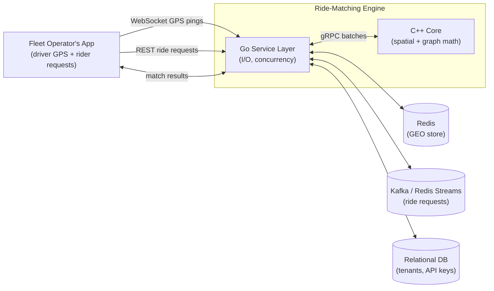
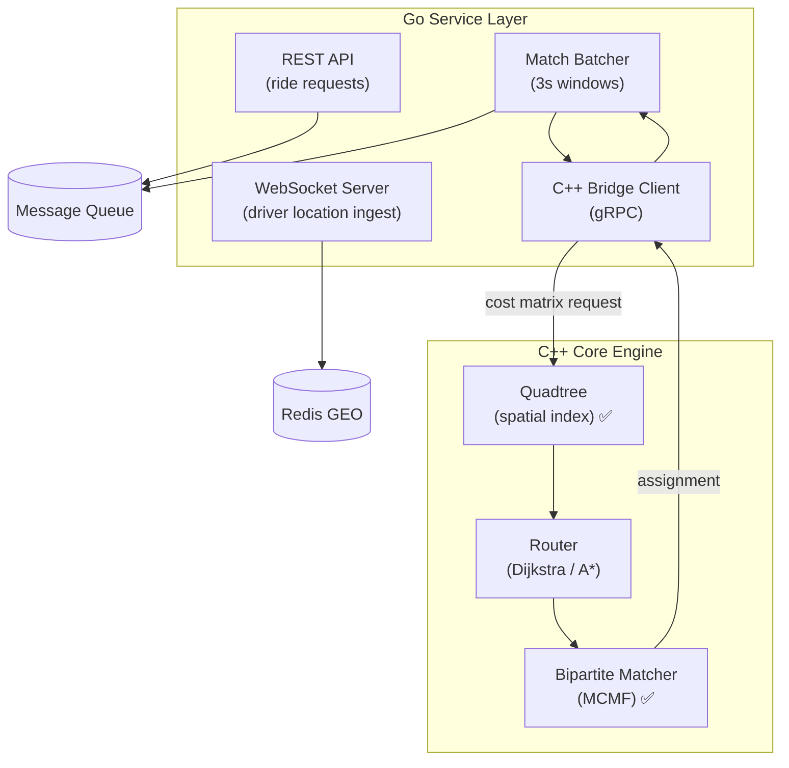
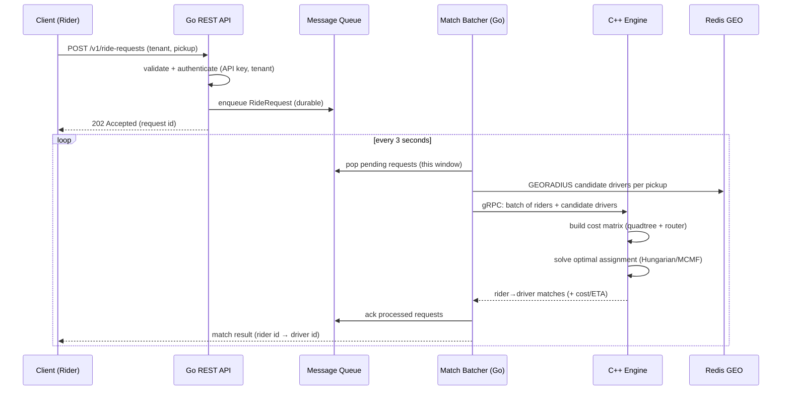
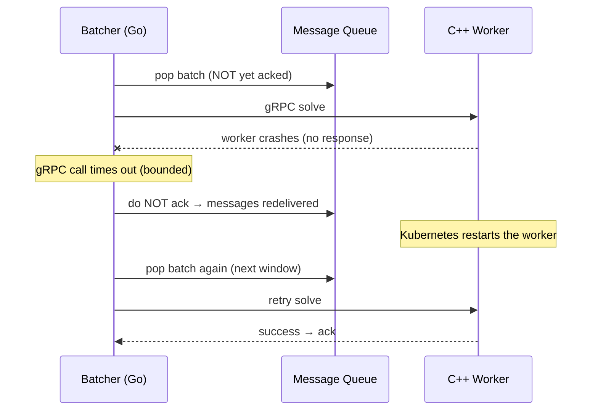

# Architecture & Data Flow

**Status:** Draft · **Related:** [Technical_Design_Document.md](Technical_Design_Document.md), [Data_Model.md](Data_Model.md)

Diagrams use [Mermaid](https://mermaid.js.org/), which GitHub and most IDEs render natively.

---

## 1. System Context (C4 Level 1)

## 2. Component View (C4 Level 2)

Legend: ✅ = implemented (Quadtree Week 2, MCMF matcher Week 3). Everything else is scheduled per the TDD.

## 3. The Critical Path: a ride request end-to-end

## 4. Failure & resiliency flow

This is the concrete realization of the **Fail-Safe Orchestration** tenet: requests are only acked *after* a successful match, so a crash re-processes rather than drops.

## 5. Key architectural boundaries

| Boundary | Contract | Why it matters |
|----------|----------|----------------|
| Client ↔ Go | [REST](api/rest-openapi.yaml) + WebSocket | public, versioned, must stay stable |
| Go ↔ C++ | [gRPC/proto](api/matching.proto) | hardest to change; defined before either side is coded |
| Go ↔ Redis/Queue/DB | repository interfaces | mockable, swappable in tests |

## 6. Scaling model

- **Go services are stateless** → scale horizontally behind a load balancer (HPA in K8s).
- **C++ workers are stateless per batch** → scale as a worker pool; a crash affects only its in-flight batch.
- **Redis / queue / DB** are the stateful tier → scaled independently, with the queue providing the durability guarantee.
